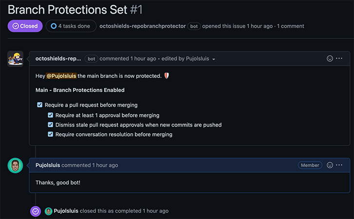
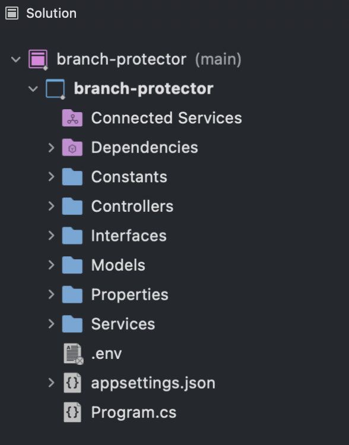

# Branch Protector GitHub App
Simple web service, that actively monitors new Repositories across a GitHub Organization and automatically protects the main branch via Branch Protections Settings.

### About Solution
The solution leverages `GitHub's Octokit .NET` Library, which is used on the server to handle authenticating as a GitHub App Installation and making calls to the GitHub API on behalf of the organization. I used the **GitHub BranchProtections and Issues API's** for automating the creation of Branch Protections and creating issues on the organization's repositories.

The GitHub App is notified in realtime of new repositories created across the organization by usign a Webhook that listens to the "repository.created" GitHub Event. The web service leverages  the `GitHub's Octokit.Webhook .NET` Library to process the incoming GitHub Events.

[Branch Protector GitHub App - Solution Whimsical Diagrams]()

### Setup Demo
- **Create GitHub App in your Organization** follow the [Creating a GitHub App](https://docs.github.com/en/developers/apps/building-github-apps/creating-a-github-app) guide and create your first GitHub App.
- **Generate & Download your GitHub App Private Key** follow the [Authenticating with GitHub Apps](https://docs.github.com/en/developers/apps/building-github-apps/authenticating-with-github-apps) guide to generate and download your Private Key Source File.
- **Create .env** file in root of `branch-protector` project, that contains your GitHub App configuration and Webhook Secret. (GitHubAppName, GitHubAppId, PATH to your Private Key Source file)
```env
GITHUB_APP_NAME=<replace-with-github-app-name>
GITHUB_APP_ID=<replace-with-github-app-id>
GITHUB_PRIVATE_KEY_SOURCE=<replace-with-private-key-source-path>
GITHUB_WEBHOOK_SECRET_KEY=<replace-with-your-webhook-secret-key>
```
- **Run** Web Service solution `branch-protector`
```bash
cd branch-protector
dotnet run
```

- **Listen and Forward** GitHub Webhook events to our local server, in order for the Branch Protector GitHub App to work.

Make sure to expose your local development environment to the internet so GitHub can deliver events, we can use `ngrok` to do this. You can learn more about it in the [Exposing localhost to the internet](https://docs.github.com/en/developers/webhooks-and-events/webhooks/creating-webhooks#exposing-localhost-to-the-internet) GitHub docs.

After installing `ngrok`, we can expose our localhost by running `./ngrok http 5095` on the terminal:
```bash
ngrok http 5095
```
The CLI will print a `*.ngrok.io URL`. We can use to set up our GitHub App webhook.

- **Test the Branch Protector GitHub App** once the web service is running and exposed to the internet, you can create a new Repository in your Organization. The Branch Protector web service will receive the "repository.created" event, create Branch Protections for the `main` branch and create an Issue with a @mention and notify the creator of the repo of Protections applied.




#### Platforms Supported
|Platform|Version|
| ------------------- | :------------------: |
|ASP .NET Core| .NET 7 |

#### Solution Structure


### Challenges
In order to complete the assignment, I had to **learn all the fundamentals about GitHub Apps**, how they interact with GitHub Organizations and how the Authentication and APIs work. The initial challenge I faced was not having worked with GitHub Apps and GitHub's newer features but I was pleased to find great documentation, an extensive API reference and Libraries I could leverage to get an understanding on how to develop a GitHub App, best practices for interacting with the GitHub APIs, and how to leverage Branch Protections to protect your branches.

### Extending the project into more robust instance
The current state of the project is not production ready and is more a POC than a MVP, I would recommeend extending it with the following improvements:
- Server:
    - Security:
        - **Add Security to REST API**
        - **Create Authentication Endpoints**
    - Repository & Branch Management:
        - **Add Endpoints** to manage repositories, branches, and issues with the GitHub API's
    - Data:
        - **Design and Implement Data Layer** - define database, model, entities, and persist and sync data with GitHub
        - **Add Caching**
    - Health Checks:
        - **Implement CI/CD Pipelines** - Leverage GitHub Actions to proactively test and deploy the code to QA and Prod environments.
        - **Implement Analytics and Crash reporting** - Leverage Azure App Service and Azure App Insights to monitor the health of our service

## Useful References for completing project
- [GitHub API Reference](https://docs.github.com/en/rest)
- [GitHub Apps guides - GitHub](https://docs.github.com/en/developers/apps/getting-started-with-apps/about-apps)
- [Webhooks guide - GitHub](https://docs.github.com/en/developers/webhooks-and-events/webhooks/about-webhooks)
- [Branch Protections guide - GitHub](https://docs.github.com/en/repositories/configuring-branches-and-merges-in-your-repository/defining-the-mergeability-of-pull-requests/about-protected-branches)
- [GitHub Octokit .NET Documentation](https://github.com/octokit/octokit.net/blob/main/docs/getting-started.md)

## Dev Tools Used
- [GitHub CLI](https://cli.github.com/)
- [GitHub Desktop](https://desktop.github.com/)
- [NGROK](https://ngrok.com/)
- [Visual Studio Code](https://code.visualstudio.com/)
- [Visual Studio For Mac 2022](https://visualstudio.microsoft.com/vs/mac/)

## Resources & Libraries
- [.NET Core](https://dotnet.microsoft.com/en-us/learn/aspnet/what-is-aspnet-core) - an [open-source](https://github.com/dotnet/core), general-purpose development platform maintained by Microsoft and the .NET community on [GitHub](https://github.com/dotnet/core)
- [ASP.NET Core](https://docs.microsoft.com/en-us/aspnet/core/?view=aspnetcore-3.1) - supports creating RESTful web services using C#. [GitHub](https://github.com/dotnet/aspnetcore)
- [GitHub Octokit .NET](https://github.com/octokit/octokit.net) - client library targeting .NET Framework 4.6 or greater and .NET Standard 2.0 and above that provides an easy way to interact with the [GitHub API](http://developer.github.com/v3/).
- [GitHub Octokit.Webhooks .NET](https://github.com/octokit/webhooks.net/) - GitHub webhook events toolset for .NET
- [GitHub JWT](https://github.com/adriangodong/githubjwt) - helper library to generate GitHub JWT from GitHub Apps private key files.
- [DotNetEnv](https://github.com/tonerdo/dotnet-env) - .NET library to load environment variables from .env files. Supports .NET Core and .NET Framework (4.6+).
    
